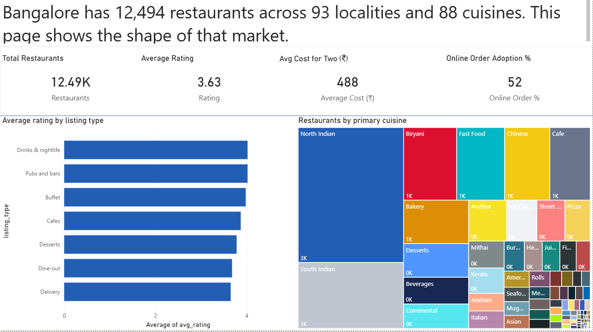
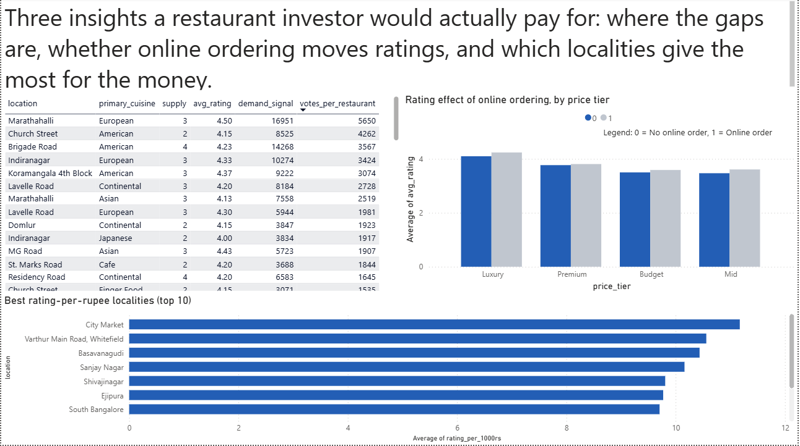
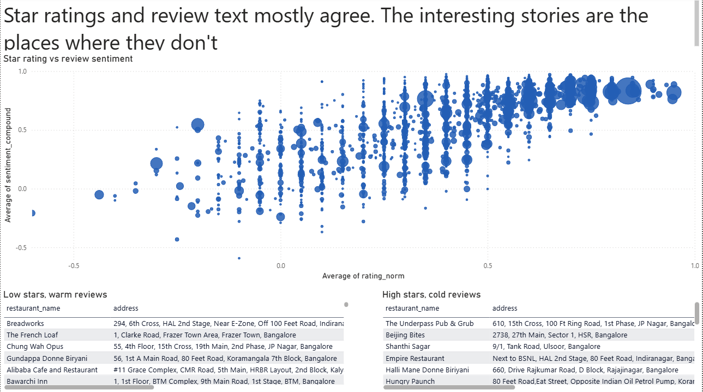
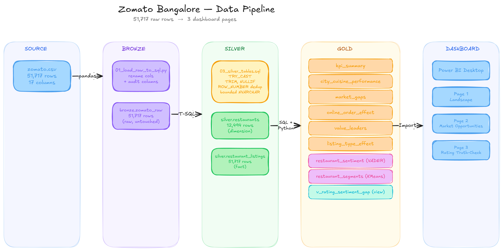

\# Zomato Bangalore - Data Engineering Project


This project takes raw restaurant data from Kaggle (Zomato Bangalore, around 51,000 rows) and turns it into a working Power BI dashboard. The pipeline goes through three layers - Bronze, Silver, and Gold - using SQL Server, Python, and Power BI. Also added sentiment scoring on the review text and KMeans clustering to group the restaurants into segments.


## Dashboard Preview








\## Tools used and why


|Layer|Tool|Reason|
|-|-|-|
|Loading|Python + pandas|The file is small (50 MB). pandas reads CSVs cleanly and pushes data straight to SQL Server with `to\\\\\\\_sql`. No need for Spark or anything heavy.|
|Storage|SQL Server|Reliable database, good support for T-SQL features I needed like window functions, CTEs, and TRY\_CAST. Also forces column types at load time, so bad data gets caught early.|
|Cleaning|T-SQL|The work here is column cleaning, type fixing, and dedup. SQL is built for exactly this. Writing the same thing in pandas would take more code and run slower.|
|Sentiment|VADER|Works well on short English reviews like these. Runs on a normal laptop CPU in a few minutes. BERT would take hours for barely better results.|
|Clustering|scikit-learn, KMeans|Easy to explain, fast, and works well with numeric features after scaling. Other options like DBSCAN don't assign every point to a cluster, which I needed|
|Dashboard|Power BI|Connects directly to SQL Server, loads data into its own fast engine, and DAX measures let me write KPI logic that points back to specific SQL columns|


What I left out on purpose: Airflow (one CSV doesn't need a scheduler), Spark (data is too small), indexes on Silver (12K rows will get scanned anyway, indexes don't help). Each of these is a choice I can defend, not something I forgot.


\## How the data flows




Source CSV gets loaded into Bronze with pandas. Silver does the cleaning and dedup in T-SQL, splitting into a restaurant dimension and a listings fact. Gold has six aggregate tables for the dashboard, plus two ML extensions (sentiment scores and KMeans segments) and one view that joins them. Power BI reads only from Gold.


\## Main findings


The dashboard is built around four insights:


1\. Marathahalli needs more European restaurants. Only three European places in that area, and all three are rated 4.5 with about 5,650 votes per restaurant. That's a clear market gap. Indiranagar (European) and Koramangala 4th Block (American) are also worth a look.


2\. Online ordering lifts ratings by about 0.14 stars in Mid and Luxury tiers. But only 27% of Luxury restaurants offer online ordering. Could be a missed chance, or could be a deliberate choice by those restaurants. The data doesn't tell you which, but the gap itself is worth noting.


3\. WYT RestroPub on MG Road has a 2.6 star rating but 89% of its 225 written reviews are positive. This is the biggest mismatch between star rating and actual review text in the whole dataset, and it has enough reviews to be taken seriously. Something is off with how the stars came about.


4\. About a quarter of Bangalore restaurants are "undiscovered favourites". 5,796 places that are cheap, don't have many votes, but the people who do eat there write very positive reviews. Good marketing target for any platform that wants to help these places get seen.


\## How to run this yourself


```bash


\# 1. Set up Python environment

conda create -n zomato python=3.11 -y

conda activate zomato

pip install pandas sqlalchemy pyodbc vaderSentiment scikit-learn


\# 2. Create the database (run in SSMS)

\# Run sql/01\_database\_setup.sql


\# 3. Load raw data into Bronze

python python/01\_load\_raw\_to\_sql.py


\# 4. Build Silver (run in SSMS)

\# Run sql/03\_silver\_tables.sql


\# 5. Build Gold structural tables (run in SSMS)

\# Run sql/04\_gold\_tables.sql - but skip the view block at the end


\# 6. Run the Python analytics

python python/02\_sentiment\_analysis.py

python python/03\_clustering.py


\# 7. Now run the view block from sql/04\_gold\_tables.sql

\# (it needs gold.restaurant\_sentiment to exist first)


\# 8. Open visualization/zomato\_dashboard.pbix in Power BI Desktop

\# and click Refresh.


```


Change the server name in the Python scripts and in the Power BI connection if you are not running against `SAIDEEPAK-PC\\SQLEXPRESS` with Windows Auth.


\## Folder layout

```
zomato-data-engineering-project/

├── data/
│ ├── raw/zomato.csv
│ ├── processed/ (empty; intermediate data lives in SQL tables)
│ └── exports/ (Gold table snapshots as CSV)

├── sql/
│ ├── 01\_database\_setup.sql
│ ├── 02\_bronze\_tables.sql (comment-only; Bronze is built by Python)
│ ├── 03\_silver\_tables.sql
│ ├── 04\_gold\_tables.sql
│ └── 05\_analysis\_queries.sql

├── python/
│ ├── 01\_load\_raw\_to\_sql.py
│ ├── 02\_sentiment\_analysis.py
│ └── 03\_clustering.py
│ └── 04\_export_gold.py  ( All the gold tables extraction)

├── visualization/
│ ├── zomato\_dashboard.pbix
│ ├── screenshots/
│ │ ├── page1\_landscape.png
│ │ ├── page2\_opportunities.png
│ │ └── page3\_truth\_check.png
│ └── visualization.md

├── docs/project\_notes.md

└── README.md

```

\## Decisions worth calling out
The project\_notes file has the full list of everything I thought about, but these are the ones I would talk about in an interview:

\- Two Silver tables instead of one.\*\* The raw file has each restaurant showing up once per Zomato listing category (Delivery, Dine-out, Buffet, and so on). If I dedup into a single table I lose the listing type. Fix was to split: `silver.restaurants` has one row per real restaurant, `silver.restaurant\_listings` keeps all the listing rows. Classic fact and dimension split.

\- No fake data. Thought about generating synthetic restaurants to have more rows to work with, but dropped the idea. The real 12,494 are enough to answer the questions I wanted to answer. Bigger datasets come later in the NYC Taxi and IPL projects.

\- No indexes on Silver. At 12K rows SQL Server will scan the whole table anyway - I checked the execution plan and confirmed it. Adding indexes just for show would look bad if anyone asked why, because I could not give a real reason.

\- Sample size check on every derived number. First time I built the rating vs sentiment comparison, the top "rating inflation suspects" all had 5 or 6 reviews. Fixed by requiring at least 20 reviews. Every derived metric needs a minimum sample size or the top of the list is just lucky outliers.

\- Showed both total and rated restaurant counts in the KPI table. 12,494 restaurants total, only 9,491 have a real rating (the rest are marked "NEW" or "-"). First version quietly hid those 3,000. Do not let a WHERE clause change a count without telling the reader.

\## Author
Sai Deepak. This is project 1 of 4 in a data engineering portfolio. The other use different tools - Python and PySpark on Databricks, and PySpark with ML - each chosen to fit the data size and question of that project.
